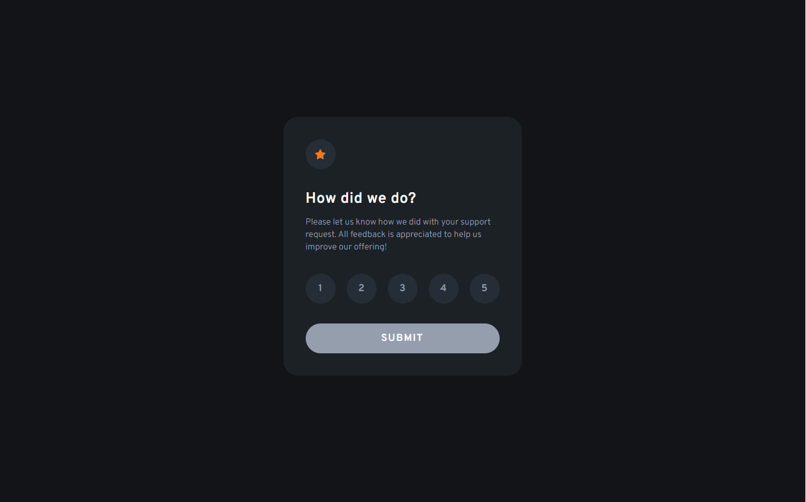
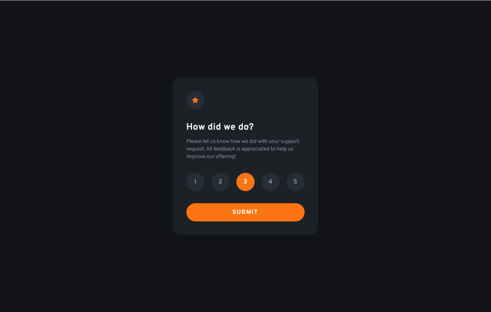
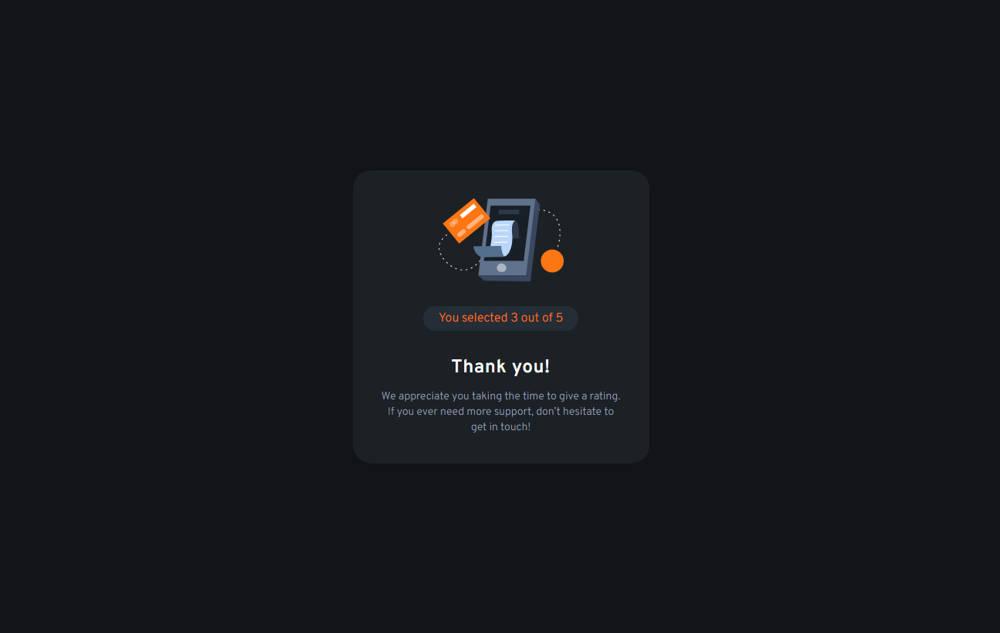
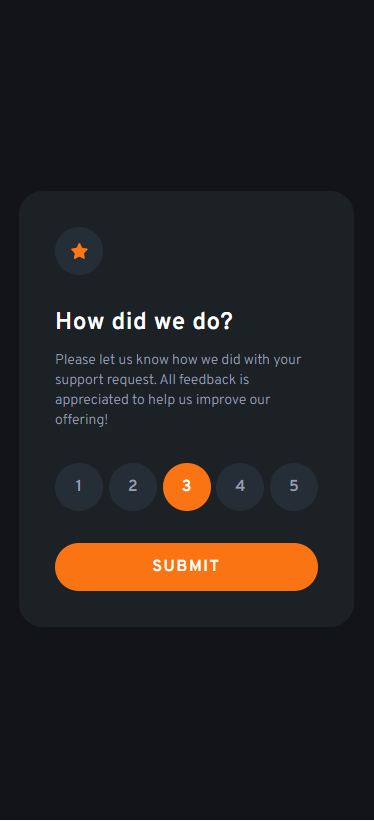
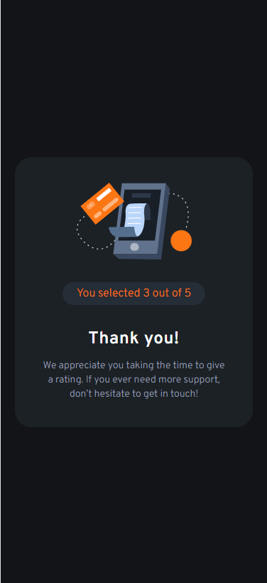

# Frontend Mentor - Interactive rating component solution

This is a solution to the [Interactive rating component challenge on Frontend Mentor](https://www.frontendmentor.io/challenges/interactive-rating-component-koxpeBUmI). Frontend Mentor challenges help you improve your coding skills by building realistic projects.

## Table of contents

- [Overview](#overview)
  - [The challenge](#the-challenge)
  - [Screenshots](#screenshots)
  - [Links](#links)
- [My process](#my-process)
  - [Built with](#built-with)
- [Author](#author)

## Overview

### The challenge

Users should be able to:

- View the optimal layout for the app depending on their device's screen size
- See hover states for all interactive elements on the page
- Select and submit a number rating
- See the "Thank you" card state after submitting a rating

### Screenshot

### Links

- [Frontend Mentor solution](https://www.frontendmentor.io/solutions/social-media-dashboard-built-with-tailwind-ZQNzbvkGmD)
- [GitHub repo](https://github.com/RoksolanaVeres/Interactive-rating-component_REACT)
- [Live Site](https://interactive-rating-component-react-mu.vercel.app/)

## My process

### Built with

- Tailwind CSS
- React

## Author

- Frontend Mentor - [@RoksolanaVeres](https://www.frontendmentor.io/profile/RoksolanaVeres)
